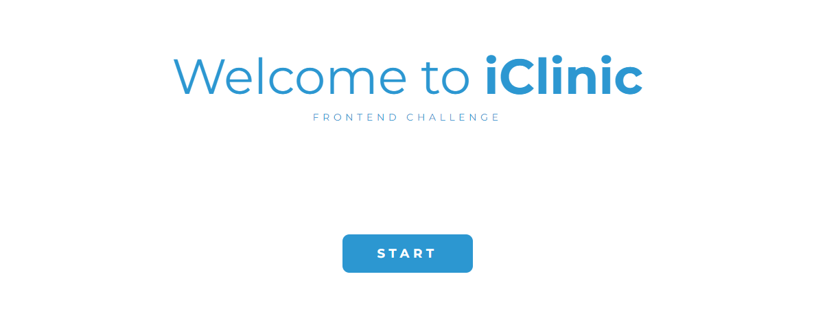
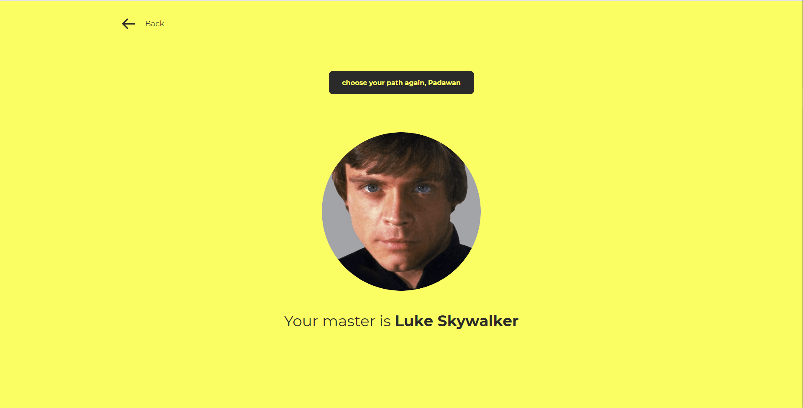
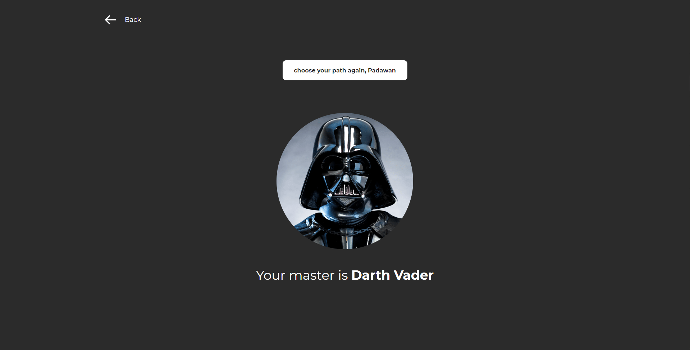
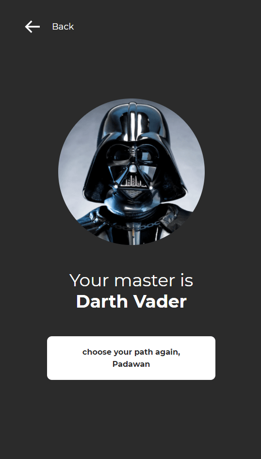

<h1 align="center">
    
</h1>

<h4 align="center"> 
	Project Star Wars | iClinic 🚀 Under development!
</h4>

 <a href="#-about-the-project">About</a> •
 <a href="#user-content-️-functionalities">Functionalities</a> •
 <a href="#-layout">Layout</a> • 
 <a href="#user-content-️-how-to-run">How to run</a> • 
 <a href="#user-content-️-technologies">Technologies</a> • 
 <a href="#-dev">Dev</a> • 
 <a href="#user-content--license">License</a>

## 💻 About the project

🚀 Challenge - Take away the SWAPI (A famous Star Wars api). Make two requests at the same time by clicking a button:

https://swapi.dev/api/people/1 -> Retrieve information from the light side, your master will be Luke Skywalker.
https://swapi.dev/api/people/4 -> Retrieve information from the dark side, your master will be Darth Vader.

Based on the service's response time and your "force" alignment, that request that returns data first will determine who will be your master and which side of the force you are aligned on...

---

## ⚙️ Functionalities

- [x] The "start" and "choose your path again, Padawan" button should call both requests and return the first response.
- [x] On the master's second screen, the image should be displayed in the center of the screen, along with its name and corresponding background color (black for the dark side and yellow for the light side).
- [x] Also on this second screen, there should be a link to return to the welcome page at the beginning of the challenge.
- [x] The button to re-choose your path in force shown on the second screen should be disabled when a request is in progress and also provide visual feedback to the user.
- [x] In mobile version, responsive on screen smaller than 800px. The order of presentation of the master's name, button to recall the force and image was also changed.
- [ ] Tests that make sense to ensure the user experience.

---

## 🎨 Layout

The application layout:

### Web

### Mobile

  
  

 
  
 <b>Jonathan Santos (Jonathan PD)</b></a>
  

 

---

## 📝 License

This project is under license [MIT](./LICENSE).

Made with ❤️ by Jonathan PD 👋🏽 [Contact us!](https://www.linkedin.com/in/jonathanpd/)

---

##  README versions

[Português 🇧🇷](./README.md)  |  [English](./README-en.md)